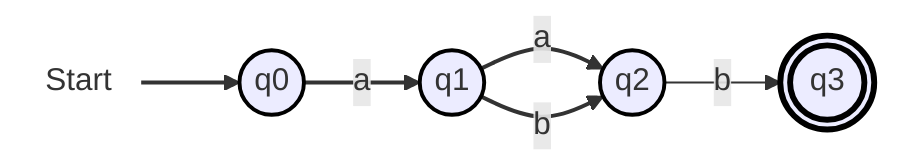

# Deterministic Finite Automata

### Example
- Regex: `a(a|b)b`

```mermaid
flowchart LR
  start(((Start))):::startNode --> q0(("q0")):::normal
  q0 --> |a| q1(("q1")):::normal
  q1 --> |a| q2(("q2")):::normal
  q1 --> |b| q2
  q2 --> |b| q3((("q3"))):::finalState

  classDef startNode fill:none,stroke:none;
  classDef normal stroke:#000,stroke-width:2px;
  classDef finalState stroke:#000,stroke-width:3px;

  linkStyle 0 stroke-width:2px;
  linkStyle 1,2,3 stroke:#333,stroke-width:2px,fill:none;
```