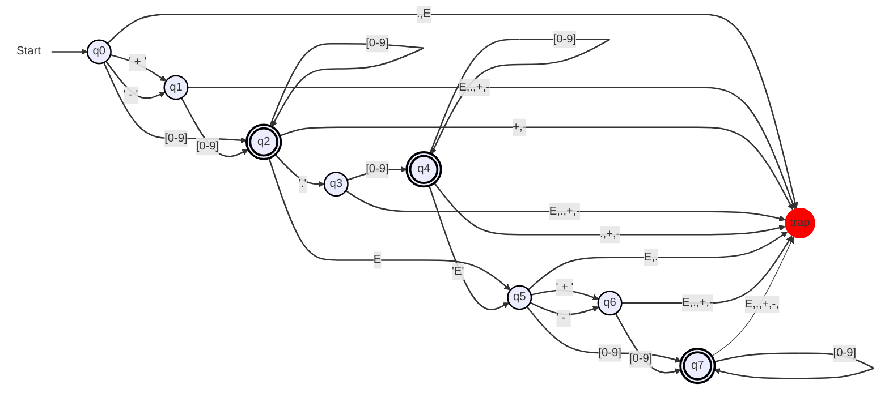
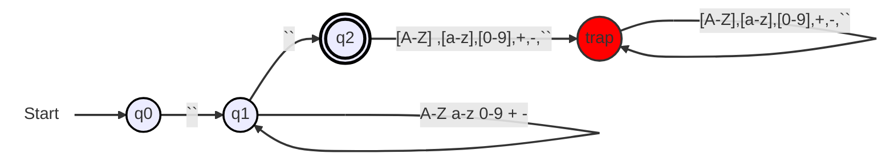

# Deterministic Finite Automata

###   Number
- Regex: `^[+-]?[0-9]+(\.[0-9]+)?(E[+-]?[0-9]+)?$`

```mermaid
flowchart LR
  start(((Start))):::startNode --> q0(("q0")):::normal
  
  q0 --> |' + '| q1(("q1")):::normal
  q0 --> |' - '| q1
  q0 --> |"[0-9]"| q2((("q2"))):::finalState
  q0 --> |" .,E "| q8(("trap")):::trapState
  
  q1 --> |"[0-9]"| q2
  q1 --> |"E,.,+,-"| q8
  
  
  q2 --> |'.'| q3(("q3")):::normal
  q2 --> |"E"| q5
  q2 --> |"+,-"| q8
  q2 --> |"[0-9]"| q2
  
  
  q3 --> |"[0-9]"| q4((("q4"))):::finalState
  q3 --> |"E,.,+,-"| q8
  
  q4 --> |'E'| q5(("q5")):::normal
  q4 --> |"[0-9]"| q4
  q4 --> |".,+,-"| q8

  q5 --> |' + '| q6(("q6")):::normal
  q5 --> |' - '| q6
  q5 --> |"E,."| q8
  q5 --> |"[0-9]"| q7((("q7"))):::finalState
  
  q6 --> |"[0-9]"| q7
  q6 --> |"E,.,+,-"| q8
  
  q7 --> |"[0-9]"| q7
  q7 --> |"E,.,+,-,"| q8

  classDef startNode fill:none,stroke:none;
  classDef normal stroke:#000,stroke-width:2px;
  classDef finalState stroke:#000,stroke-width:3px;
  classDef trapState fill:red,stroke:none;

  linkStyle 0 stroke-width:2px;
  linkStyle 1,2,3,4,5,6,7,8,9,10,11,12,13,14,15,16,17,18,19,20,21,22 stroke:#333,stroke-width:2px,fill:none;

```

###  String
- Regex: ` ^"[^"]*"$ `

```mermaid
flowchart LR
  start(((Start))):::startNode --> q0(("q0")):::normal

  q0 --> |``| q1(("q1")):::normal

  q1 --> |"A-Z a-z 0-9 + -"| q1
  q1 --> |``| q2((("q2"))):::finalState
  

  q2 --> |"[A-Z] ,[a-z],[0-9],+,-,``"| q3(("trap")):::trapState  

  q3 --> |"[A-Z],[a-z],[0-9],+,-,``"| q3  

  classDef startNode fill:none,stroke:none;
  classDef normal stroke:#000,stroke-width:2px;
  classDef finalState stroke:#000,stroke-width:3px;
  classDef trapState fill:red,stroke:#333,stroke-width:2px;

  linkStyle 0 stroke-width:2px;
  linkStyle 1,2,3,4,5 stroke:#333,stroke-width:2px,fill:none;


```

