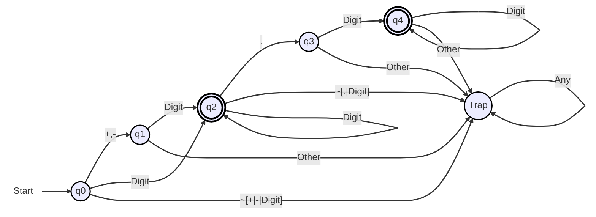
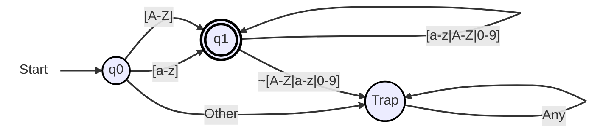
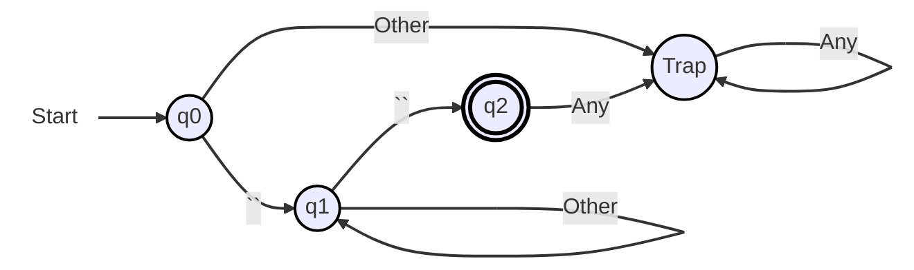
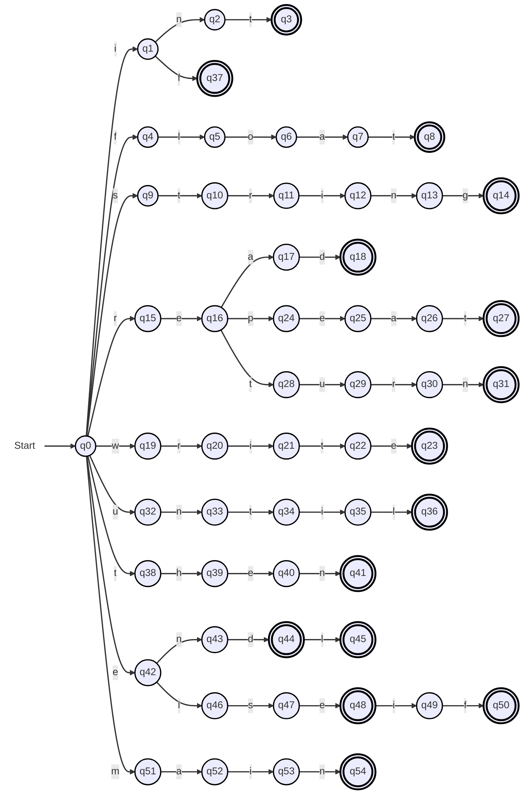
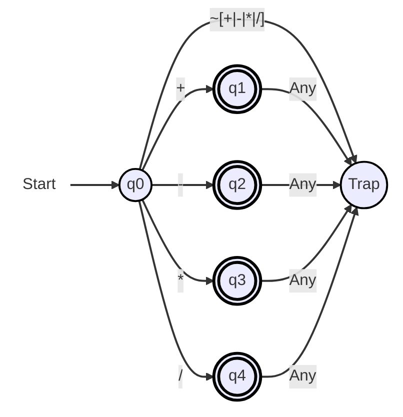
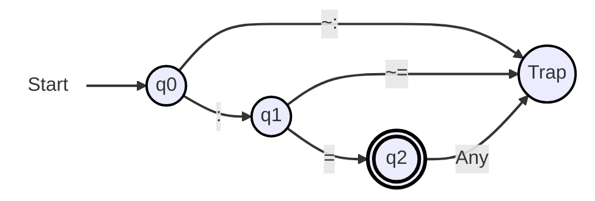
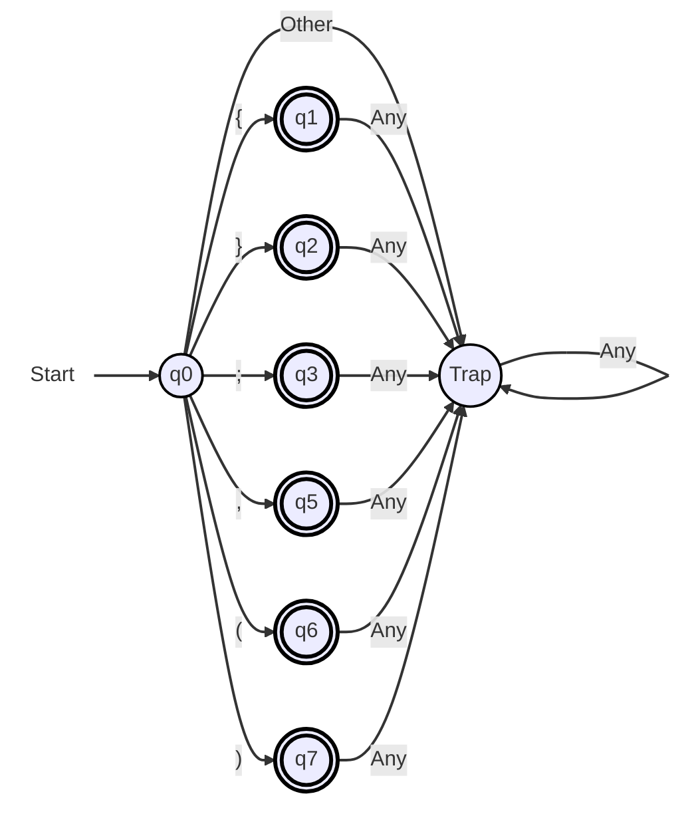
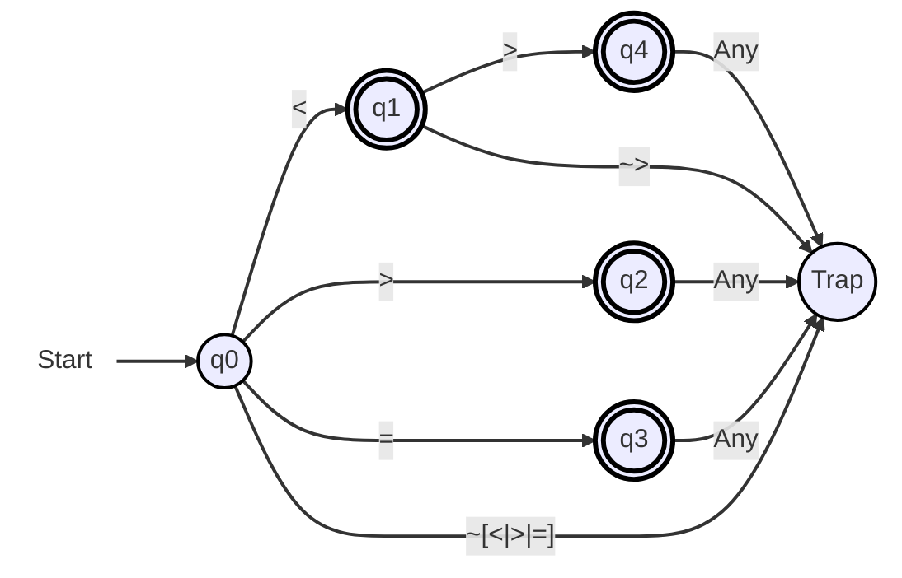
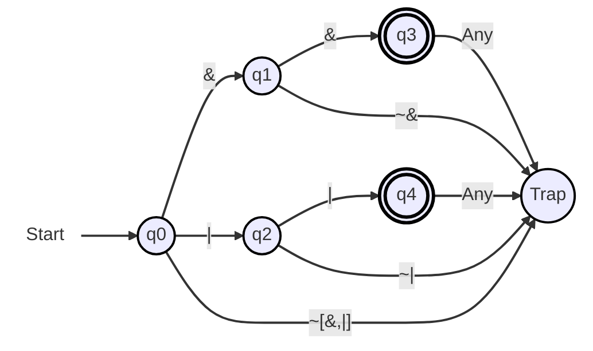

# Tokens Regex + Deterministic Finite Automata

### Number

- Regex : `(\+|-)?[0-9]+(\.[0-9]+)?`
- Digit : `[0-9]`
- Other : `~[0-9]`
- Any : `Other|Digit`

### Identifier
- Regex: `[A-Z|a-z][A-Z|a-z|0-9]*`
- Other: `~[A-Z|a-z]`
- Any: `Other|[A-Z|a-z]`

 
\pagebreak 

### String

- Regex: `"(~")*"`
- Other: `(~")`
- Any: `Other|"`

### Reserved_Keywords

- Regex: `int | float | string | read | write | repeat | until | if | elseif | else | then | return | endl | end | main`

 
\pagebreak 

### Arithmetic_Operators

- Regex: `\+|\-|\*|/`
- Any: `-|~-"`

<!-- I am using these HTML character codes (e.g. #43;) since directly using '+' or '-' or '*' gives syntax errors with the mermaid syntax -->

### Assignment_Operator

- Regex: `:=`
- Any: `=|~=`

 
\pagebreak 

### Delimiters

- Regex: `{|}|;|,|(|)`
- Other: `~({|}|;|,|(|))`
- Any: `(|~(`

 
\pagebreak 

### Condition_Operators

- Regex: `< | > | = | <>`
- Any: `=|~=`

### Boolean_Operators

- Regex: `&& | \|\|`
- Any: `&|~&`

