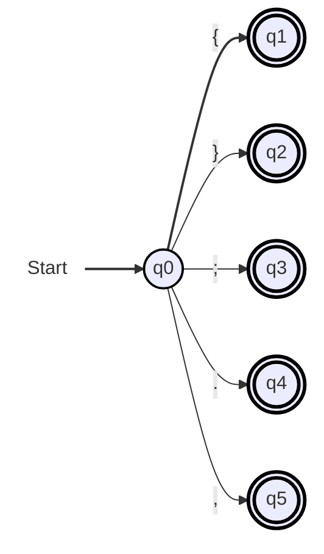

# Deterministic Finite Automata

### Example

- Regex: `a(a|b)b`

### Reserved_Keywords

- Regex: `int | float | string | read | write | repeat | until | if | elseif | else | then | return | endl | end | main`

### Arithmetic_Operators

- Regex: `\+|-|\*|\/`

<!-- I am using these HTML character codes (e.g. #43;) since directly using '+' or '-' or '*' gives syntax errors with the mermaid syntax -->

### Assignment_Operator

- Regex: `:=`

### Delimiters
